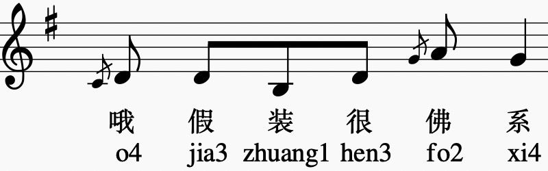
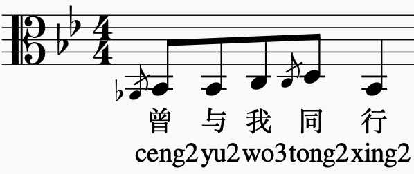

_Weiya You, Shaohuan Zhou, Yuren You, Jiankun Hu, Zhiyong Wu, Shiyin Kang_

# ABSTRACT

The acciaccatura is a kind of ornaments which is very commonly used in playing or singing. The flexible use of the acciaccatura can make the singing more expressive. However, as far as we observe, there is no research on the analysis of the acciaccatura and its prediction. In this paper, we analyze a Chinese music score dataset with acciaccatura annotations. Base on the analysis results, we obtain the factors affecting the acciaccatura: duration and pitch, and use them as features, after being encoded by embedding, they are feed into BiLSTM-CRF models which have good performance in named entity recognition (NER) to predict the acciaccatura position and pitch. Finally, the ABX tests is used to verify that the music score containing the model's predicted acciaccatura allowed the singing voice synthesis model to synthesize a more beautiful song.

# ACCIACCATURA PREDICTION

Our goal is to predict the acciaccatura position and acciaccatura pitch from the original score. Finally, the acciaccatura score is used to synthesize a more beautiful song.

## PREDICTION ACCIACCATURA POSITION IS THE SAME AS LABELING

The percentage of sentences predicted and labeled exactly the same is 69.61%.

| No        | Labeled music score        | Audio | Without acciaccatura        | Audio | Predicted music score        | Audio |
|:----------|:---------------------------|:------|:----------------------------|:------|:-----------------------------|:------|
| 1         |  | <audio controls><source src="assets/audios/007027_label.wav" type="audio/wav">Your browser does not support the audio element.</audio>  |  | <audio controls><source src="assets/audios/007027_no.wav" type="audio/wav">Your browser does not support the audio element.</audio>  |  | <audio controls><source src="assets/audios/007027_pred.wav" type="audio/wav">Your browser does not support the audio element.</audio>  |
| 2         |  | <audio controls><source src="assets/audios/015039_label.wav" type="audio/wav">Your browser does not support the audio element.</audio>  |  | <audio controls><source src="assets/audios/015039_no.wav" type="audio/wav">Your browser does not support the audio element.</audio>  |  | <audio controls><source src="assets/audios/015039_pred.wav" type="audio/wav">Your browser does not support the audio element.</audio>  |
| 3         |  | <audio controls><source src="assets/audios/077023_label.wav" type="audio/wav">Your browser does not support the audio element.</audio>  |  | <audio controls><source src="assets/audios/077023_no.wav" type="audio/wav">Your browser does not support the audio element.</audio>  |  | <audio controls><source src="assets/audios/077023_pred.wav" type="audio/wav">Your browser does not support the audio element.</audio>  |
| 4         |  | <audio controls><source src="assets/audios/095020_label.wav" type="audio/wav">Your browser does not support the audio element.</audio>  |  | <audio controls><source src="assets/audios/095020_no.wav" type="audio/wav">Your browser does not support the audio element.</audio>  |  | <audio controls><source src="assets/audios/095020_pred.wav" type="audio/wav">Your browser does not support the audio element.</audio>  |
| 5         |  | <audio controls><source src="assets/audios/187001_label.wav" type="audio/wav">Your browser does not support the audio element.</audio>  |  | <audio controls><source src="assets/audios/187001_no.wav" type="audio/wav">Your browser does not support the audio element.</audio>  |  | <audio controls><source src="assets/audios/187001_pred.wav" type="audio/wav">Your browser does not support the audio element.</audio>  |
| 6         |  | <audio controls><source src="assets/audios/242023_label.wav" type="audio/wav">Your browser does not support the audio element.</audio>  |  | <audio controls><source src="assets/audios/242023_no.wav" type="audio/wav">Your browser does not support the audio element.</audio>  |  | <audio controls><source src="assets/audios/242023_pred.wav" type="audio/wav">Your browser does not support the audio element.</audio>  |
| 7         |  | <audio controls><source src="assets/audios/059004_label.wav" type="audio/wav">Your browser does not support the audio element.</audio>  |  | <audio controls><source src="assets/audios/059004_no.wav" type="audio/wav">Your browser does not support the audio element.</audio>  |  | <audio controls><source src="assets/audios/059004_pred.wav" type="audio/wav">Your browser does not support the audio element.</audio>  |

## LESS PREDICTION ACCIACCATURA POSITION THAN LABELING

The percentage of sentences with only partial acciaccatura labels missing was 16.99%.

| No        | Labeled music score        | Audio | Without acciaccatura        | Audio | Predicted music score        | Audio |
|:----------|:---------------------------|:------|:----------------------------|:------|:-----------------------------|:------|
| 1         |  | <audio controls><source src="assets/audios/082005_label.wav" type="audio/wav">Your browser does not support the audio element.</audio>  |  | <audio controls><source src="assets/audios/082005_no.wav" type="audio/wav">Your browser does not support the audio element.</audio>  |  | <audio controls><source src="assets/audios/082005_pred.wav" type="audio/wav">Your browser does not support the audio element.</audio>  |
| 2         |  | <audio controls><source src="assets/audios/436007_label.wav" type="audio/wav">Your browser does not support the audio element.</audio>  |  | <audio controls><source src="assets/audios/436007_no.wav" type="audio/wav">Your browser does not support the audio element.</audio>  |  | <audio controls><source src="assets/audios/436007_pred.wav" type="audio/wav">Your browser does not support the audio element.</audio>  |
| 3         |  | <audio controls><source src="assets/audios/018007_label.wav" type="audio/wav">Your browser does not support the audio element.</audio>  |  | <audio controls><source src="assets/audios/018007_no.wav" type="audio/wav">Your browser does not support the audio element.</audio>  |  | <audio controls><source src="assets/audios/018007_pred.wav" type="audio/wav">Your browser does not support the audio element.</audio>  |
| 4         |  | <audio controls><source src="assets/audios/103011_label.wav" type="audio/wav">Your browser does not support the audio element.</audio>  |  | <audio controls><source src="assets/audios/103011_no.wav" type="audio/wav">Your browser does not support the audio element.</audio>  |  | <audio controls><source src="assets/audios/103011_pred.wav" type="audio/wav">Your browser does not support the audio element.</audio>  |
| 5         |  | <audio controls><source src="assets/audios/241037_label.wav" type="audio/wav">Your browser does not support the audio element.</audio>  |  | <audio controls><source src="assets/audios/241037_no.wav" type="audio/wav">Your browser does not support the audio element.</audio>  |  | <audio controls><source src="assets/audios/241037_pred.wav" type="audio/wav">Your browser does not support the audio element.</audio>  |

## MORE PREDICTION ACCIACCATURA POSITION THAN LABELING

The percentage of sentences with more partial acciaccatura labels was 10.01%.

| No        | Labeled music score        | Audio | Without acciaccatura        | Audio | Predicted music score        | Audio |
|:----------|:---------------------------|:------|:----------------------------|:------|:-----------------------------|:------|
| 1         |  | <audio controls><source src="assets/audios/156011_label.wav" type="audio/wav">Your browser does not support the audio element.</audio>  |  | <audio controls><source src="assets/audios/156011_no.wav" type="audio/wav">Your browser does not support the audio element.</audio>  |  | <audio controls><source src="assets/audios/156011_pred.wav" type="audio/wav">Your browser does not support the audio element.</audio>  |
| 2         |  | <audio controls><source src="assets/audios/029006_label.wav" type="audio/wav">Your browser does not support the audio element.</audio>  |  | <audio controls><source src="assets/audios/029006_no.wav" type="audio/wav">Your browser does not support the audio element.</audio>  |  | <audio controls><source src="assets/audios/029006_pred.wav" type="audio/wav">Your browser does not support the audio element.</audio>  |
| 3         |  | <audio controls><source src="assets/audios/052019_label.wav" type="audio/wav">Your browser does not support the audio element.</audio>  |  | <audio controls><source src="assets/audios/052019_no.wav" type="audio/wav">Your browser does not support the audio element.</audio>  |  | <audio controls><source src="assets/audios/052019_pred.wav" type="audio/wav">Your browser does not support the audio element.</audio>  |
| 4         |  | <audio controls><source src="assets/audios/439000_label.wav" type="audio/wav">Your browser does not support the audio element.</audio>  |  | <audio controls><source src="assets/audios/439000_no.wav" type="audio/wav">Your browser does not support the audio element.</audio>  |  | <audio controls><source src="assets/audios/439000_pred.wav" type="audio/wav">Your browser does not support the audio element.</audio>  | 

## SAME NUMBER, PREDICTION ACCIACCATURA POSITION OFFSET

The percentage of predicted sentences with the same number of acciaccatura but with acciaccatura position shifts was 2.42%.

| No        | Labeled music score        | Audio | Without acciaccatura        | Audio | Predicted music score        | Audio |
|:----------|:---------------------------|:------|:----------------------------|:------|:-----------------------------|:------|
| 1         |  | <audio controls><source src="assets/audios/076024_label.wav" type="audio/wav">Your browser does not support the audio element.</audio>  |  | <audio controls><source src="assets/audios/076024_no.wav" type="audio/wav">Your browser does not support the audio element.</audio>  |  | <audio controls><source src="assets/audios/076024_pred.wav" type="audio/wav">Your browser does not support the audio element.</audio>  |
| 2         |  | <audio controls><source src="assets/audios/130040_label.wav" type="audio/wav">Your browser does not support the audio element.</audio>  |  | <audio controls><source src="assets/audios/130040_no.wav" type="audio/wav">Your browser does not support the audio element.</audio>  |  | <audio controls><source src="assets/audios/130040_pred.wav" type="audio/wav">Your browser does not support the audio element.</audio>  |
| 3         |  | <audio controls><source src="assets/audios/244042_label.wav" type="audio/wav">Your browser does not support the audio element.</audio>  |  | <audio controls><source src="assets/audios/244042_no.wav" type="audio/wav">Your browser does not support the audio element.</audio>  |  | <audio controls><source src="assets/audios/244042_pred.wav" type="audio/wav">Your browser does not support the audio element.</audio>  |

## OTHER SITUATIONS

The percentage of sentences with other cases was 0.957%.

| No        | Labeled music score        | Audio | Without acciaccatura        | Audio | Predicted music score        | Audio |
|:----------|:---------------------------|:------|:----------------------------|:------|:-----------------------------|:------|
| 1         |  | <audio controls><source src="assets/audios/003000_label.wav" type="audio/wav">Your browser does not support the audio element.</audio>  |  | <audio controls><source src="assets/audios/003000_no.wav" type="audio/wav">Your browser does not support the audio element.</audio>  |  | <audio controls><source src="assets/audios/003000_pred.wav" type="audio/wav">Your browser does not support the audio element.</audio>  |
